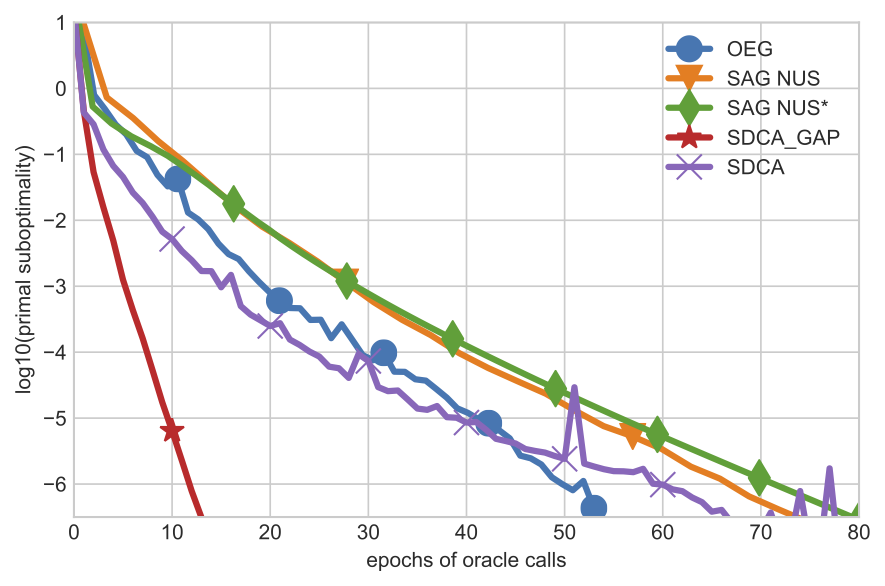

# SDCA4CRF

Stochastic dual coordinate ascent for training conditional random fields.

## Depends

Python 3.6, Numpy, Scipy, Matplotlib, [tensorboard_logger](https://github.com/TeamHG-Memex/tensorboard_logger).

## Usage

Call `main.py` with the desired arguments.
The full list of arguments is specified in `sdca4crf/arguments.py`.
The main training loop is in `sdca4crf/sdca.py`.
Four pre-processed datasets are available, courtesy of [Mark Schmidt](https://www.cs.ubc.ca/~schmidtm/). A typical use case is:

`python main.py --dataset ner --non-uniformity 0.8 --sampling-scheme gap`

You can use tensorboard to visualize training. Training curves and other results are also saved into pickle files at the end of training.

## Other methods
To compare against other methods on the same datasets, use the Matlab package [SAG4CRF](https://www.cs.ubc.ca/~schmidtm/Software/SAG4CRF.html).

